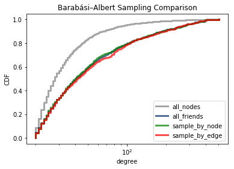
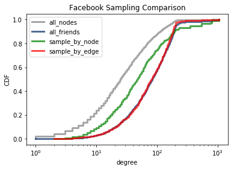
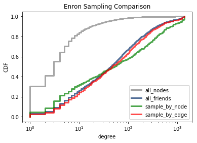
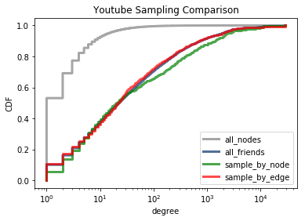

# How to Convince Yourself That You Have More Friends Than Your Friends
Serena Chen and Evan Lloyd New-Schmidt

## Abstract

In his 1991 paper _Why your friends have more friends than you do_, Thomas Feld observed the “friendship paradox”, that most people have fewer friends than their friends. In replicating the experiment we found that different methods of sampling friends would yield the same results in the Barabasi-Albert model that we used, but would yield slightly different results on datasets collected from real world networks, specifically SNAP’s dataset on the Facebook network. We set out to explore why these methods of sampling yielded different results and which better represents the friendship paradox.

## Comparing Sampling Methods

We started with comparing the distribution of friends-of-friends for a sampling of edges or a sampling of nodes for a variety of datasets, mostly from SNAP.  Sampling by edges was done by randomly selecting an edge on the network and randomly selecting one of the edge’s nodes, as was done in Feld’s original study. Sampling by node was done by randomly selecting a node on the network and randomly selecting one of that node’s friends. We compared the distributions of these two methods of sampling with the distribution of friends-of-friends for all nodes. We noticed that all three of these distributions were mostly equivalent for the Barabasi-Albert graph, but for SNAP’s Facebook, Enron, and Youtube datasets, sampling by node resulted in a different distribution than sampling by edges or directly sampling all friends. Specifically, in many of the real-world networks, more nodes have a smaller friend count when sampling by node than when sampling by edges.

## Observing Graph Characteristics

We also tried looking at a few graph metrics. One metric we found interesting was degree associativity, or how likely a node would have neighbors with similar degree. The Barabasi-Albert graph has a significantly larger correlation coefficient for degree associativity than the other real-world networks, which means nodes in the Barabasi-Albert graph are more likely to be connected to nodes of similar degree. The real-world networks have coefficients very close to 0, which shows little to no correlation. However, Ugander et. al stated in their paper that the coefficient should be around 0.226 for most social networks, and the NetworkX implementation of this same metric gives wildly different results, so this number may not be accurate. However, if we take these numbers to be accurate descriptions of the graph, then one possible explanation is that sampling by node somehow biases the measure of friends-of-friends to the “friends” that have smaller degree. Another way of putting this is that sampling by node may not be biased towards friends with high degree, while sampling by edge does.

We also tried other metrics, such as clustering coefficient, degeneracy, and path length, but we have not fully analyzed those metrics.

| Network         | Number of Nodes | Number of Edges | Cluster. Coef.  | Degeneracy      | Degree Assoc.   |
| ---             | ---             | ---             | ---             | ---             | ---             |
| Barabasi-Albert |            4000 |           79600 |        0.035    |      486        |        0.347    |
| Facebook        |            4039 |           88234 |        0.605    |     1045        |        0.114    |
| Enron           |           36692 |          183831 |        0.496    |     1383        |        0.024    |
| Youtube         |         1134890 |         2987624 |        0.080    |    28754        |       -0.025    |

Table 1: Table of graph metrics

## Annotated Bibliography

Feld, S. L. (1991). _Why your friends have more friends than you do._ American Journal of Sociology, 96(6), 1464-1477.  
Feld explores the phenomenon of the friendship paradox, where most people on average tend to have fewer friends than their friends. He observes this through a network of high school friendships. He showed why the paradox exists, and how different network structure affects it.

Ugander, J., Karrer, B., Backstrom, L., & Marlow, C. (2011). _The anatomy of the facebook social graph._ arXiv preprint arXiv:1111.4503. Chicago  
Ugander et. al performed many different kinds of analyses on the facebook social graph, including degree distribution, degrees of separation, clustering and sparsity, site engagement, and directly addressing Feld’s friends of friends phenomenon. They conclude that the facebook social graph is highly connected, but with high clustering coefficient and high sparsity. It also shows that Feld’s friend of friends phenomenon is present in over 90% of facebook users.

Newman, M. E., & Park, J. (2003). _Why social networks are different from other types of networks._ Physical Review E, 68(3), 036122.  
Newman and Park discuss the structure of social networks and how they differ from other networks. They observe high clustering levels and hypothesize that this is the result of communities in social networks. They propose a model of community structure to explain the clustering.
