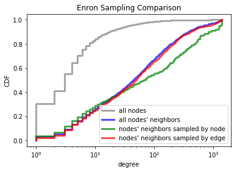

# Various Methods of Measuring Self-Worth
_[Serena Chen](https://github.com/poosomooso) and [Evan Lloyd New-Schmidt](https://github.com/newsch)_

**Abstract**

In his 1991 paper _Why your friends have more friends than you do_, Thomas Feld observed the “friendship paradox” that most people have fewer friends than their friend’s mean number of friends. In replicating the experiment we find that different methods of sampling friends yield the same results in the Barabasi-Albert model that we use, but yield different distributions on datasets collected from real world networks, specifically SNAP’s dataset on the Facebook network. We set out to explore why these methods of sampling yielded different results and the effects of using these different sampling methods.

---

We replicate Feld’s comparison of the distribution of friends and friends of friends with SNAP’s facebook dataset. In doing so we find that the distributions show similar behavior to Feld’s distributions of Marketville girl friend groups: the distribution of users’ friends shows that few users have many friends, while the distribution of friends of users’ friends is a weighted version of the original distribution weighted towards users with many friends.

_Feld's comparison of friend distribution_

_Our comparison of friend distribution with SNAP's Facebook data_

The mean of the distribution of users’ friends is 43.7, while the mean of the distribution of users’ friends’ friends is 106.6. In this case, if individuals compared their number of friends with the mean number of friends of their own friends, and their friends were a representative sample of friends (with a mean number of friends of friends of 106.6), then 67.5% of individuals would find themselves to be “relatively deprived”. In Feld’s original study, he found that 74% of the individuals in Marketville would find themselves to be “relatively deprived”.

We also plot the distribution of user’s friends and users’ friends’ friends’ on a CDF (Cumulative Distribution Function) with a logarithmic x axis for easier comparison and analysis. This will be useful later in the paper.

## Comparing Node-Based and Edge-Based Sampling

We start with comparing the distribution of friends-of-friends for a sampling of edges or a sampling of nodes for a variety of datasets, mostly from SNAP.  Sampling by edges is done by randomly selecting an edge on the network and randomly selecting one of the edge’s nodes, as was done in Feld’s original study. Sampling by node was done by randomly selecting a node on the network and randomly selecting one of that node’s friends. We compare the distributions of these two methods of sampling with the distribution of friends-of-friends for all nodes. We notice that all three of these distributions are mostly equivalent for the Barabasi-Albert graph, but for SNAP’s Facebook, Enron, and Youtube datasets, sampling by node resulted in a different distribution than sampling by edges or directly sampling all friends. Specifically, in many of the real-world networks, more nodes have a smaller friend count when sampling by node than when sampling by edges.

We also studied the Holme-Kim model of scale-free networks, which is similar to the Barabasi-Albert model, except, in an effort to better model the clustering coefficient, when the new node adds an edge between itself and an existing node, the new node has a chance of adding an edge between itself and one of the _neighbors_ of the aforementioned existing node. The higher the probability of attaching to neighbors, the higher the clustering coefficient, thus more accurately modeling a scale free network. We notice that the difference between the node sampled and edge sampled version of friends of friends is more distinct in the Holme-Kim graph than in the Barabasi-Albert.

_Holme-Kim graph, with a 0.1 probability. Clustering Coefficient = 0.070671_

_Holme-Kim graph, with a 0.4 probability. Clustering Coefficient = 0.085863_

_Holme-Kim graph, with a 0.7 probability. Clustering Coefficient = 0.067098_

_Holme-Kim graph, with a 1.0 probability. Clustering Coefficient = 0.174503_

From our results with the Holme-Kim networks, we hypothesize that there is a correlation between clustering coefficient and the inconsistencies between edge sampling and node sampling. We are not able to fully experiment with this hypothesis to see if it is true1; however, the correlation holds thus far, since the Barabasi-Albert graph has a much lower clustering coefficient than any of the other networks (as shown in Table 1), and shows this discrepancy the least.

| Network         | Number of Nodes | Number of Edges | Cluster. Coef.  |
| ---             | ---             | ---             | ---             |
| Barabasi-Albert |            4000 |           79600 |        0.035    |
| Facebook        |            4039 |           88234 |        0.605    |
| Enron           |           36692 |          183831 |        0.496    |
| Youtube         |         1134890 |         2987624 |        0.080    |

_Table 1: Clustering coefficients for the Barabasi-Albert graph and the real world graphs._

We explored high clustering being correlated to greater discrepancy between edge-based and node-based sampling. Say you have a network, and there is a cluster in the network that is highly connected. We will model this cluster as a regular graph. Let’s also say that there are x vertices and y edges in the rest of the graph. We will model the order of growth for the probability of randomly selecting an edge or a vertex that is in the cluster as the cluster size grows:

| Vertices in cluster | Edges in cluster | Probability of selecting a node in the cluster | Probability of selecting an edge in the cluster |
| --- | --- | --- | --- |
| 3 | 3 | 3/(x+3) | 3/(y+3) |
| 4 | 6 | 4/(x+4) | 6/(y+6) |
| 5 | 10 | 5/(x+5) | 10/(y+10) |
| 6 | 15 | 6/(x+6) | 15/(y+15) |
| 7 | 21 | 7/(x+7) | 21/(y+21) |
| 8 | 28 | 8/(x+8) | 28/(y+28) |

_Table 2: Order of growth, with cluster size, of the probability of randomly selecting an edge or vertex in a cluster._

The probability of choosing an edge in the cluster is much higher than the probability of choosing a node in the cluster for large clusters. If we assume that nodes in clusters have higher degree than nodes not in clusters, then sampling by node will have a higher proportion of nodes not in clusters, and thus nodes with smaller degree are more sampled.

In conclusion, the best way to convince yourself that you have more friends than your friends is to be in a very large, tight-knit friend group and then sample by nodes (randomly select a bunch of people in your network, and for each person randomly select one of their friends), and you will probably be above average.

1 We learned of the existence of this model approximately 24 hours before the submission of this report.

## Annotated Bibliography

Feld, S. L. (1991). _Why your friends have more friends than you do._ American Journal of Sociology, 96(6), 1464-1477.  
Feld explores the phenomenon of the friendship paradox, where most people on average tend to have fewer friends than their friends. He observes this through a network of high school friendships. He showed why the paradox exists, and how different network structure affects it.

Ugander, J., Karrer, B., Backstrom, L., & Marlow, C. (2011). _The anatomy of the facebook social graph._ arXiv preprint arXiv:1111.4503. Chicago  
Ugander et. al performed many different kinds of analyses on the facebook social graph, including degree distribution, degrees of separation, clustering and sparsity, site engagement, and directly addressing Feld’s friends of friends phenomenon. They conclude that the facebook social graph is highly connected, but with high clustering coefficient and high sparsity. It also shows that Feld’s friend of friends phenomenon is present in over 90% of facebook users.

Newman, M. E., & Park, J. (2003). _Why social networks are different from other types of networks._ Physical Review E, 68(3), 036122.  
Newman and Park discuss the structure of social networks and how they differ from other networks. They observe high clustering levels and hypothesize that this is the result of communities in social networks. They propose a model of community structure to explain the clustering.
