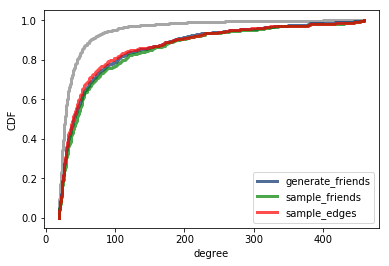
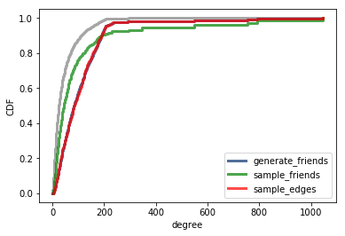

# Friend-Value Hacking
_or_
# Folks with No Friends
_or_
# Various Methods of Measuring Self-Worth
_or_
# How to Convince Yourself That You Have More Friends Than Your Friends

### Serena Chen and Evan Lloyd New-Schmidt

We are exploring the different ways of measuring the friendship paradox and why it causes different results in certain types of networks. Specifically, the differences that arise when you measure the friendship paradox by sampling random edges vs. random nodes. This phenomenon was first observed by [Allen B. Downey](https://scholar.google.com/citations?user=GxBFR3sAAAAJ&hl=en), who wrote a Jupyter Notebook showing the differences.

We’ll build on what Allen Downey has started replicating Feld’s work and test the node and edge methods for friend sampling across other datasets and with different models. Currently, the notebook shows the distribution for both methods of random sampling, and we can see the difference by visual inspection. We will perform this test on other models as well. We may also be able to define a mathematical relationship between mean/median friend-degree and various metrics of a network.

Some example graphs:

Sampling by nodes and by edges yield similar distributions with a Barabassi-Albert graph.

Sampling by nodes and by edges yield dissimilar distributions with a Facebook dataset.

We will also measure an assortment of graph properties for the different networks, and see if there is any correlation between the different properties and the difference of sampling methods. These graph properties may include connectivity, clustering coefficients, max/min/average degree, and others.

We will start with the [Stanford Facebook](https://snap.stanford.edu/data/facebook_combined.txt.gz) dataset that the notebook uses, but we might branch into more up to date datasets of other social networks. Alternatively, we may use the dataset used in Feld’s paper, from Coleman’s book *The Adolescent Society*.

We’ve got a pretty clear question and solution, but how much we’ll be able to read into it is questionable. Depending on what datasets we find/use, we may be more or less able to reliably determine the cause of the discrepancies between edge vs node friend calculation.

We started **[a public trello board](https://trello.com/b/WBuaY8eJ)** with the things that need to be done (like submitting this to canvas) and things that we would like to try, such as seeing the edge vs node sampling differences in other models/datasets, and exploring the structures of these models/datasets. This will be updated throughout the project.

## Annotated Bibliography

Feld, S. L. (1991). Why your friends have more friends than you do. American Journal of Sociology, 96(6), 1464-1477.

Feld showed the friendship paradox through a network of high school friendships. He showed why the paradox exists, and how different network structure affects it.

Ugander, J., Karrer, B., Backstrom, L., & Marlow, C. (2011). The anatomy of the facebook social graph. arXiv preprint arXiv:1111.4503.
Chicago

Ugander et. al performed many different kinds of analyses on the facebook social graph, including degree distribution, degrees of separation, clustering and sparsity, site engagement, and directly addressing Feld’s friends of friends phenomenon. They conclude that the facebook social graph is highly connected, but with high clustering coefficient and high sparsity. It also shows that Feld’s friend of friends phenomenon is present in over 90% of facebook users.

Newman, M. E., & Park, J. (2003). Why social networks are different from other types of networks. Physical Review E, 68(3), 036122.

Newman and Park discuss the structure of social networks and how they differ from other networks. They observe high clustering levels and hypothesize that this is the result of communities in social networks. They propose a model of community structure to explain the clustering.

TODO:
Kossinets, G. (2006). Effects of missing data in social networks. Social networks, 28(3), 247-268.
